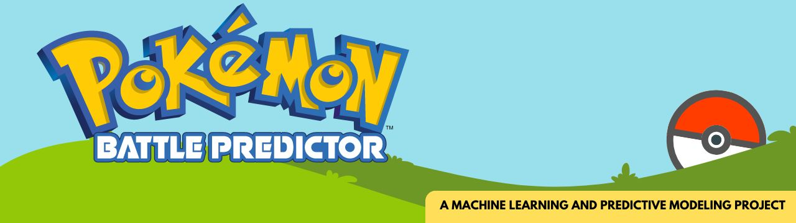

# Pokémon Battle Predictor
*Machine Learning and Predictive Modeling - Group Project*

## Background
The Pokémon Battle Predictor is a machine learning project developed to predict the outcomes of Pokémon battles. By using data of over 40,000 matchups, we built and optimized Sequential Neural Network and Random Forest models to achieve high accuracy in our predictions. We built a user-friendly web interface with Flask and JavaScript which allows users to select Pokémon and receive battle predictions between two opponents.

## Pokémon Trainers
- **[Travis Cook](https://github.com/byTravis)**
- **[Matthew Groh](https://github.com/mdg1317)**
- **[Marshal Rittenger](https://github.com/Ray-Marshal)**

## Approach

### ETL
We initially had two datasets--one for the battles and one for the Pokémon. The battle dataset contained about 50,000 battles, where each one only recorded the two Pokémon that fought (identified by ID numbers) and the ID of the Pokémon that won, while the Pokémon dataset contained all of the information for each Pokémon, such as their name, types, and stats, connected to their ID. To simplify our data, we joined the two datasets to show the Pokémon stats in each fight and the winner of each fight. After dropping the columns that would have no effect on the battle data, such as the Pokémons' names, we converted each of the Pokémons' types to a numerical value indicating how "effective" it is versus its opponent. This was done both for easier interpretation and in the interest of reducing the number of features for the model. In the end, our final dataset contained the ~50,000 matches, where the features were the Pokémons' stats and calculated effectiveness, and the target was a binary output: 0 if the first Pokémon won, or 1 if the second Pokémon won.

### Machine Learning Modeling
For our classification models, we decided to focus on two types that work well for binary classification: Sequential Neural Networks and Random Forest Models. Our first attempts at both were very successful; both baseline models were around 94% accurate. However, we knew with some optimization techniques we could hopefully make some improvements. For the random forest model, we decided to take a closer look at which features were the most important. After doing this, it was clear that there were some that could feasibly be removed with no diminishing of the results (or perhaps even an improvement). There was a small but noticeable improvement after doing this, so we decided to try taking away even more features and ran the model again. This resulted in about the same accuracy, so we kept those features for the following test. We then found some optimization functions in scikit-learn that could help us refine the model even further: RandomizedSearchCV and GridSearchCV. Both allow you to set certain hyperparemeters of each model and test different combinations of said hyperparameters. Randomized search allows you to set the number of different iterations for it to attempt, while GridSearch allows you to test all of the combinations you give it. We ran these functions with our Random Forest and our Neural Network models. After these optimizations we found, through ANOVA analysis, that there was a small, but statistically significant improvement with the Random Forest Model. We are happy that the Pokémon data that we did find was so successful in making the battle predictions, but if we had more time it would have been interesting to find more models and optimization methods to create even better predictions. 

### User Interface
To create a user interface, we chose to use Flask to run a server environment.  This will allow us to pass data between a web page and Python allowing us to utilize our machine learning model.

The web page was built with HTML, CSS, and JavaScript, with the Bootstrap framework providing the layout structure.  JavaScript to reads the Pokémon names from a CSV to populate the dropdown selectors and dynamically updates each Pokémon's image and stats. 

When the "Predict The Winner" button is clicked, JavaScript sends a query to the Flask app, submitting the selected Pokémon names for Player 1 and Player 2. The Flask app receives the names, retrieves each Pokémon’s stats, and formats the data to match the formating used during model training. It then creates a single-row DataFrame, which is fed to the model to predict the outcome. A result of 0 indicates that Player 1 is predicted to win, whereas a result of 1 indicates that Player 2 is predicted to win. These results are sent back to JavaScript, which then displays the winner’s name and image in the center column.

Whenever any of the selections change, the Battle Predictor is reset for the next potential matchup.

# Skills and Technologies Used In This Project
- SKLearn
- Pandas
- SQL
- Flask
- HTML (with Bootstrap)
- CSS
- Javascript
- Web Scraping (Beautiful Soup & Splinter)

# How To Use The Pokémon Battle Predictor
1. Download this Github repository and unzip it into a local folder.
2. Unzip 'final_rf_model.zip' - This is the random forest model used for predicting outcomes.
3. Run 'pokemon_app.py' - This will launch the Flask server environment.
4. In a browser, go to: http://127.0.0.1:5000/ to run the Pokémon Battle Predictor web page.

## Attribution
- [Pokémon Dataset with Team Combat](https://www.kaggle.com/datasets/tuannguyenvananh/pokemon-dataset-with-team-combat)
- Pokémon names and images sourced from [The Pokémon Company](https://www.pokemon.com/us).  Used for educational purposes only.
- Optimization code and instruction. [Towards Data Science: Hyperparameter Tuning the Random Forest in Python](https://towardsdatascience.com/hyperparameter-tuning-the-random-forest-in-python-using-scikit-learn-28d2aa77dd74)
